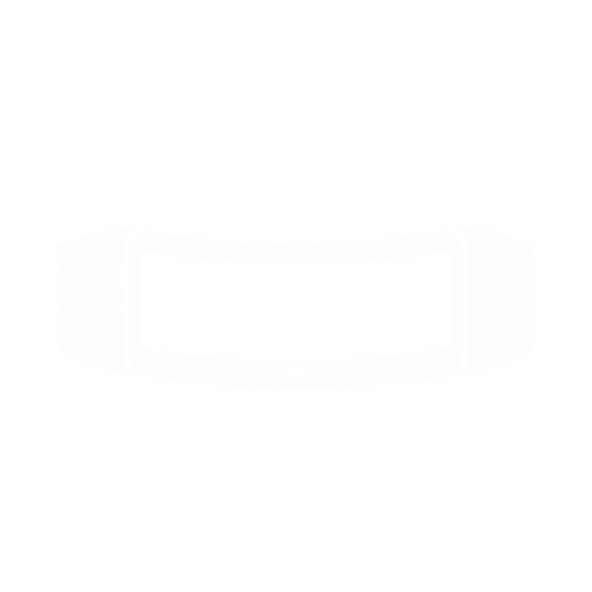

# Microband

<p align="center">
  
</p>

<p align="center">
  An unofficial, open-source Android companion app for Microsoft Band 2.
</p>

<p align="center">
  
  
  
</p>

Microband brings Microsoft Band 2 back online on modern Android devices without Microsoft Health, a Microsoft account, analytics, or a replacement cloud service. It communicates directly with the Band over Bluetooth and keeps companion data on the phone.

> [!IMPORTANT]
> Microband is an independent community project. It is not affiliated with, endorsed by, or supported by Microsoft. Microsoft, Microsoft Band, and Microsoft Health are trademarks of Microsoft Corporation.

## Project status

Microband is early-stage software built around reverse-engineered interoperability information. Core setup and everyday companion features work on physical Band 2 hardware, but releases should still be treated as experimental.

| Feature | Status |
| --- | --- |
| Android companion-device association | Working |
| Classic Bluetooth RFCOMM connection | Working |
| Band 2 identification and diagnostics | Working |
| First-run Band setup/OOBE completion | Working |
| UTC, local time, and timezone sync | Working |
| Android notification forwarding | Working |
| Notification filters and privacy controls | Working |
| Theme colors | Working |
| Me Tile wallpaper | Experimental |
| Firmware package validation | Working |
| Firmware flashing | Not enabled |
| Activity, sleep, and workout history | Planned |
| Health Connect export | Planned |

Microsoft Band 1 is not currently supported.

## Features

- Finds new and already-paired devices named `MSFT Band 2 xx:xx`.
- Associates through Android's secure Companion Device Manager.
- Uses the public SDP-based RFCOMM API—no root access or hidden Bluetooth APIs.
- Inspects PCB, firmware, application, setup, and clock state.
- Safely resumes and completes first-run Band 2 setup.
- Synchronizes both UTC and displayed local time.
- Forwards selected Android notifications with persistent filters, duplicate suppression, rate limiting, locked-phone privacy, and automatic reconnection.
- Changes the Band's six-color theme using friendly color presets.
- Center-crops photos locally into the Band 2's 310 × 128 Me Tile format.
- Validates the archived Band 2 firmware package before it can be considered for future update support.
- Provides opt-in protocol diagnostics with private notification and wallpaper payloads redacted.

## Requirements

- Microsoft Band 2
- Android 12 or newer (API 31+)
- Bluetooth and Nearby devices access
- Notification access, only if notification forwarding is wanted

Development requires JDK 17 and an Android SDK containing API 37.

## Installation

Prebuilt releases are not published yet. For now, build and install a debug APK from source.

```bash
git clone https://github.com/SAM2WOW/Microband.git
cd Microband
./gradlew assembleDebug
```

On Windows PowerShell:

```powershell
git clone https://github.com/SAM2WOW/Microband.git
Set-Location Microband
.\gradlew.bat assembleDebug
```

The APK is created at `app/build/outputs/apk/debug/app-debug.apk`. Install it with Android Studio or ADB:

```bash
adb install -r app/build/outputs/apk/debug/app-debug.apk
```

## First setup

1. Charge the Band and keep it close to the phone.
2. Open Microband and grant Nearby devices access.
3. Tap **Find my Band** and select the Band in Android's device picker.
4. Confirm the Bluetooth pairing code on both devices if prompted.
5. Tap **Connect**.
6. If the Band is factory-reset, follow **Finish setup**. Microband checks the device model and current OOBE state before sending setup commands.
7. Open **Notifications** to choose which alerts may appear on the Band.
8. Open **Personalize** to select a theme color or Me Tile wallpaper.

If the Band was previously paired with another phone, remove that pairing from the Band before trying again.

## Privacy

Microband is local-first by design:

- no Microsoft account;
- no analytics or telemetry;
- no custom backend;
- no cloud upload;
- no advertising SDK;
- notification access is optional;
- notification bodies are never persisted in protocol logs;
- selected wallpaper pixels are processed locally and redacted from protocol logs.

## Firmware safety

Firmware flashing is intentionally disabled. Microband can identify the installed firmware and validate the known Band 2 `2.0.5202.0` archive package, but it will not flash it until battery checks, recovery paths, transfer verification, and interruption handling have been validated on hardware.

Installing incorrect or interrupted firmware can permanently damage a Band. Please do not add an unrestricted flashing path.

## Building and testing

Run unit tests, lint, and a debug build:

```powershell
.\gradlew.bat testDebugUnitTest lintDebug assembleDebug
```

The unit tests cover packet framing, status parsing, time conversion, timezone payloads, notification encoding and classification, personalization colors, and association matching.

A physical Band 2 is required to validate Bluetooth discovery, RFCOMM behavior, OOBE, notification display, themes, wallpapers, and future firmware operations.

## Architecture

```text
Jetpack Compose UI
        │
        ▼
MicrobandViewModel
        │
        ├── BandAssociationManager
        ├── BandConnectionManager
        ├── NotificationListenerService
        └── MicrobandPreferences / Room
                    │
                    ▼
              BandProtocol
                    │
                    ▼
            RFCOMM Band transport
```

`BandConnectionManager` is the single owner of the active Band transport. Protocol commands are serialized so screens and background notification forwarding do not create competing Bluetooth sockets.

## Contributing

Issues, protocol observations, documentation improvements, and pull requests are welcome.

1. Fork the repository.
2. Create a focused branch: `git switch -c feature/short-description`.
3. Keep hardware mutations safety-gated and Band 2-specific.
4. Add tests for packet formats and pure mapping logic.
5. Run `testDebugUnitTest`, `lintDebug`, and `assembleDebug`.
6. Open a pull request explaining what was tested on real hardware.

Please never include Bluetooth addresses, notification contents, health data, firmware files, signing keys, or other private device data in issues or commits.

## Protocol references and acknowledgements

Microband is an independent Android implementation informed by publicly available interoperability research and community projects, including:

- [libmsftband](https://github.com/ksiazkowicz/libmsftband)
- [msband-lib-9th](https://github.com/MicrosoftBandDev/msband-lib-9th)
- [MicrosoftBandDev/band-sdk](https://github.com/MicrosoftBandDev/band-sdk)
- [MicrosoftBandDev/companion-app](https://github.com/MicrosoftBandDev/companion-app)

These projects have different licenses. Contributors must respect the license and attribution requirements of any source they consult and should document the provenance of newly added protocol behavior.

## License

Microband is licensed under the [GNU General Public License v3.0](LICENSE).

You may use, study, modify, and redistribute it under the terms of that license. Distributed modified versions must make their corresponding source available under GPL-3.0.
